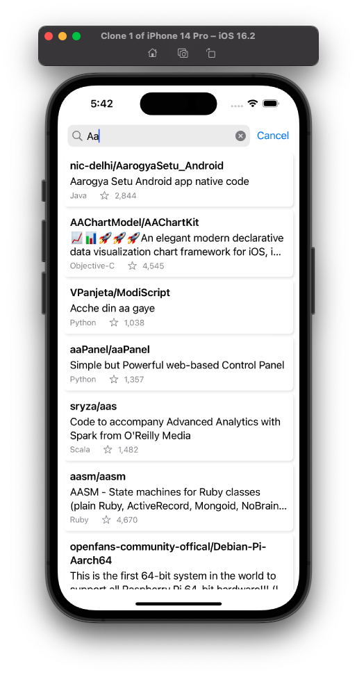

# Purpose of this document
To provide the overview on how to run the code, and to explain the architecture with the motivation behind, such the readers could understand

# Developer's Build environment
- xcode 14.2, macOS Monterey 12.6.1, Intel Mac
- Deployment target: iOS 16
- Testing Device (Simulator): iPhone14 Pro (iOS 16.2)
- build scheme for the app: `github`

# Architecture
### UI Library: Hybrid of SwiftUI & UIKit
- more precisely speaking, SwiftUI in UIKit
- Motivation
  - Demonstrate the ability to write codes in both SwiftUI and UIKit, which are common in most modern app development environment
  - Technique of wrapping SwiftUI components in UIKit is useful for
    - as a process of migrating exisiting UIKit's code to SwiftUI, which cannot be done all at once
    - avoiding specific SwiftUI's bugs

### MVVM Architecture
- MVVM stands for Model-View-ViewModel
  - `ViewModel`: Responsible for handling the business logic to generate data for UI. Independent of the actual ui operation required to update the view.
  - `ViewController`: Responsible for the actual operation required to update the UI. Independent of the business logic to generate data for Home's UI.
- Motivation:
  - Achieve the seperation fo concern between UI and Business logic
  - Increase the testability of the program, as codes involving UI's operation are difficult to test
  - Increase the readibility of the program, as codes can be written in a more "reactive" and "functional" manner

### Directory Structure of `github`
1. UI Layer (`Views`)
2. Presentation Layer (`ViewModel`)
3. Domain (`UseCases`)
4. Data Layer (`API`)

### Multimodule
- `Core` is seperated as a dynamic framework from `github`
  - `Core`: A common module, independent of business logic or specific requirement. Contains a number of extensions of UIKit's ViewController, or utility functions.
  - `github`: The main target for building the app, containg business logic
  Note: A possible way to further seperate `github` is to convert different `/Feature` in sepearted libraries, which would highly speed up the build process during actual development, since we seldom work on all the features at the same time.
- Motivation
  - avoid implicit dependency from `Core` to `github`, such that a seperation of concerned can be imposed with better confidence
  - increase build speed, as codes on `Core` are changed much less often than that in `github`, such that `Core` is not required to be rebuilt everytime

# Quality
Code is guaranteed functioning correctly using the following test codes:

- logics on `github` are tested by the target `githubTests`

I believe an effective test code should not only aim for coverage and testing the accuracy of functions, but it should be written in a way the different scenarios of of using the app can be well expressed, with expected results from requirement. For example, I have written scenarios including "first time to display the home view" (`test_initialLoad()`), "user entering a text" (`test_updatedSearchText()`), etc. This is done by architecturing the code with seperation of concern and a number of data mocking techniques. It is recommended to take a look at the test files to understand the edge cases that have been taken care of in this app.

# Remarks

### Further Improvement on code (if I am given more time in actual working environment)
- (code) API Keys should be kept secret and ignored from pushing to code sources. A way to achieve this is to create a sepearte file, which is listed on `.gitignore`.
- (code) writting even more patterns of `struct HomeView_Previews: PreviewProvider`, so that the correctness of UI can also be guaranteed for more patterns.
- (code) seperate `RepositoryDetail` from `Home`, such that they can be treated as different features independently, which improve maintainability of the code base for future changes
- (requirement) Introduce "loading" when it's making query, and handle errors with more pattern

### Some Screenshots for references
  
  
  
  
